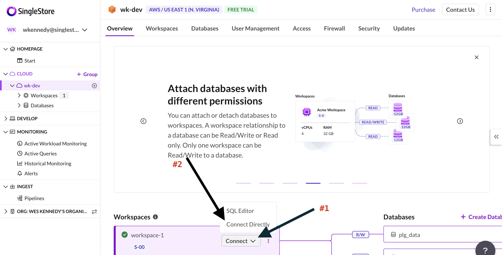
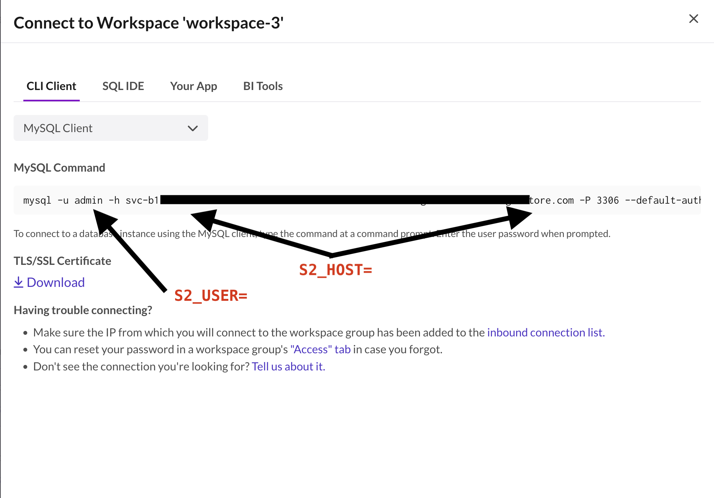

# ChatGPT for PLG: Talk with Your Salesforce or Segment Data

In today’s competitive landscape, Product Led Growth (PLG) is emerging as a crucial strategy for scaling your business. Central to PLG is the ability to deeply understand your data and user activity. Knowing what campaigns are working, and why, is essential for high-growth and successful products. Join us for an exclusive webinar where we will walk you through building a powerful application that allows you to interact with your Salesforce or Segment data using ChatGPT. This hands-on session, powered by Langchain and a vector database, will guide you on keeping your internal data private and secure. Learn how to seamlessly handle multi-model data in different formats from various sources, empowering your Marketing, Demand Gen, Product, and Engineering teams to make data-driven decisions with confidence.

## What You'll Learn

- Hands-on Demo: Building an app using Langchain and a vector database
- Data Privacy & Security: Best practices for keeping your internal data private and secure
- Multi-Model Data Handling: Strategies for integrating and querying data in different formats from various sources

## Featured Speakers
- [Madhukar Kumar](https://github.com/madhukarkumar/), Chief Developer Evangelist at SingleStore
- [Wes Kennedy](https://github.com/wesdottoday/), Principal Technical Evangelist at Singlestore

## Instructions

Below you'll find the instructions you need to follow in order to deploy this yourself.

### Common Steps

1. Clone this repo onto a VPS or something which you can reverse proxy to safely
    ``` shell
    git clone git@github.com:singlestore-labs/webinar-code-examples.git
    cd chat-with-plg-data
    ```

### SingleStore

1. Sign up for SingleStoreDB using [this Cloud Trial link](https://bit.ly/chatgpt-for-plg-raffle) to receive $600 in credit!
2. Accept the Terms of Use
3. Create a New Workspace.
    - The workspaces allow you to choose your preferred Cloud Provider, Region, Version of SingleStoreDB
    - You can also set the auto-terminate feature, which will suspend your workspace when it has been determined inactive for a period of time you choose. (This helps save your credits!)
4. Go to SQL Editor, under Develop and create your database:
    - Choose your workspace in the dropdown at the top
    - Run the following SQL to create your DB

    ``` sql
    CREATE DATABASE plg_data;
    ```
    - Click Run
5. Create the Actions table
    - Choose your workspace and database in the dropdown at the top
    - Copy the contents of `create_table_actions.sql` and paste into SQL Editor
    - Click Run
6. Create the Customers table
    - Choose your workspace and database in the dropdown at the top
    - Copy the contents of `create_table_customers.sql` and paste into SQL Editor
    - Click Run

### Segment

1. Create a Segment Account
2. Create a Segment Source (Python), save the Access Key it gives you in a safe place
3. Create a Segment Destination (Webhook), do not fill anything out right now, except choosing the source (which you defined in the last step)

### Deploy Data Generator

1. Create the `.env` file for the Data Generator
    ``` shell
    cd generator
    mv .env.sample .env
    ```
2. Edit the `.env` to set the `SEGMENT_WRITE_KEY` to what you received from Segment when creating the Python Generator Source
3. Build the docker container locally
    ``` shell
    docker build -t gpt4plg_generator:0.0.1 .
    ```
4. Run the docker container to see if it works
    ``` shell
    docker run gpg4plg_generator:0.0.1 .
    ```
    - Validate that the service starts and services are listening from your host at Port 5000.
    > Note: SingleStore is not responsible for the security ramifications from testing this demo. When in doubt, please work with your security team to use a proper testing environment.
    - Log into Segment > Sources > Your Python Generator > Debug
    - You should see new events coming in to Segment

### Deploy Webhook Server

1. In a new terminal window, cd into the `webinar/chat-with-plg-data` folder.
2. Create the `.env` file for the Webhook Server
    ``` shell
    cd webhook_server
    mv .env.sample .env
    ```
3. Edit the `.env` file to set the variables to what you need
4. Retrieve SingleStoreDB credentials
    - Click on your cloud group
        
    - Click on your Workspace/Connect drop down, then choose "Connect Directly"
        
    - Get your Username and Host URL
        
   > Note:
   >    - The user will almost always be `admin`, so set that aside
   >    - Following user, you'll see the connection URI (Hint: it'll begin with `svc...`), copy that and set aside
   - Take those two items `user` and `host` and then edit your `.env` file with those variables
   ``` shell
   vi .env # use whatever editor you're comfy with
   ```
   ``` shell
   S2_HOST=svc...
   S2_USER=admin
   S2_PASS=
   OPENAI_API_KEY=
   ```
   - Choose your Cloud Group again, Click Access, then set your admin password. Update your .env file to reflect.
   ``` shell
   S2_HOST=svc...
   S2_USER=admin
   S2_PASS=thisismypassword
   OPENAI_API_KEY=
   ```
5. Retrieve your OpenAI key
    - Create an OpenAI account
    - Click on your user, then click API Keys
    - Generate an API key
    - update `.env` to reflect this API key
   ``` shell
   S2_HOST=svc...
   S2_USER=admin
   S2_PASS=thisismypassword
   OPENAI_API_KEY=thisismyapikey
   ```

6. Build the docker container
    ``` shell
    docker build -t gpg4plg_webhook:0.0.1 -t gpg4plg_webhook:latest .
    ```
7. Deploy the docker container

    ``` shell
    docker run -p 0:0:0:0:5000/:5000 gpg4plg_webhook:0.0.1 .
    ```

### Re-run the generator

At this point you should be able to re-run the generator container and see data begin populating in your database.